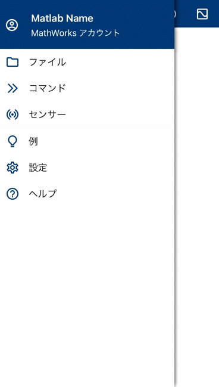
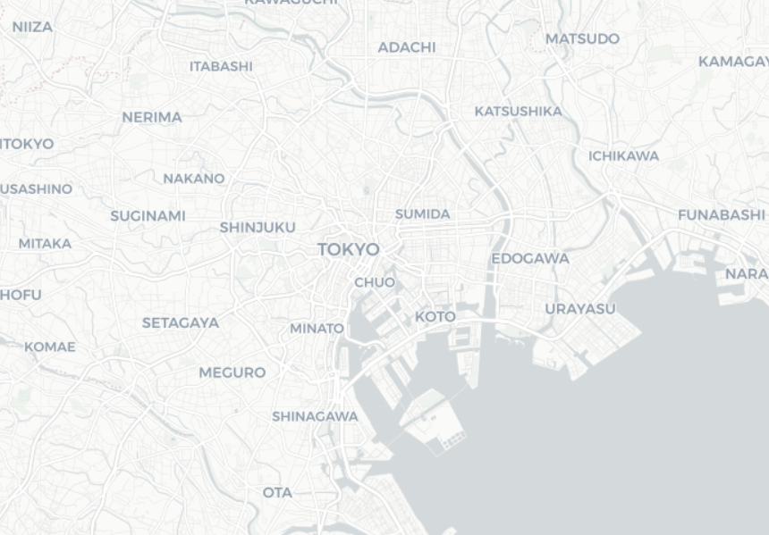
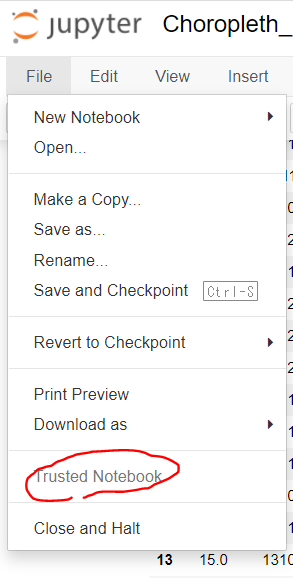
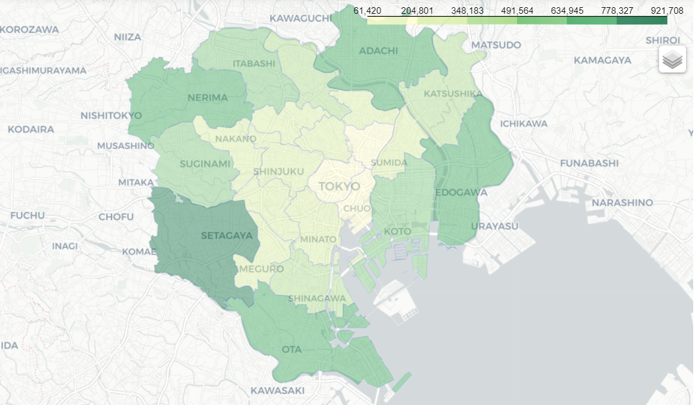

# MATLAB Mobile(無料枠)とPythonライブラリ folium によるGPSデータのプロット   
このスクリプトではMATLAB Mobileの無料枠の機能を利用して、MATLAB Mobileをiphoneにインストールした後、それを持って移動したときのGPSによる位置情報を地図上にプロットするということを行います。地図へのプロットはpythonを用いて行います。移動中のスマートフォンのGPSデータを一定時間ごとに保存し、その軌跡を地図上にマッピングすることを行います。今回は都内を自動車で移動したときのGPS情報を描き、さらに23区の人口を色のグラデーションで示してみます。
# 最終出力のイメージ

# このスクリプトについて

特にここでは、人口の情報をグラデーションで示す意味はないのですが、キレイな図になったのでその機能を使った履歴も残そうと思います。
今後の自分用のまとめとして作成したものをここで公開させていただきます。Foliumをもちいたプロットに関しては、末尾の参考文献がわかりやすく、それらを見ながら進めるとよいのですが、ところどころエラーが出るところもあり、その対処の自分用の備忘録としたいと思います。GPSデータの取得やコーディングに関してもまだまだ改善の余地があり、何かございましたら教えていただけますと幸いです。

# MATLAB Mobileについて
プログラミング言語のひとつであるMATLABは有料ですが、MATLAB Mobileというスマートフォンでも実行できるアプリも用意されており、アカウントを作成することで、無料でも一部の機能を使うことができます。詳しい内容についてはMatrixVectorScalarさまの「[MATLAB 無償利用できる機能のまとめ](https://qiita.com/MatrixVectorScalar/items/718cd7e7c0764088917b)」が非常に参考になりました。その中でも以下に示すようなスマートフォンのセンサーデータ（加速度、磁場、位置など）の取得機能が個人的におもしろく、何か遊んでみようと思いました。
　例えばスマートフォンにダウンロードしたMATLAB Mobileを開いて以下のように操作するとセンサーを簡単に取得することができます。ここでは、加速度などの情報を取得しています。
<br>


# MATLAB Mobileによるセンサーデータの取得

簡単にMATLAB Mobileをつかってデータ取得する方法について記述します。取得したデータはMATLAB DriveというGoogle DriveやDropboxのようなストレージに保存されます。無料版では2021年9月の時点で250MB分を無料で保存できます。

   1.  ストリーム先をログにする（リアルタイムでクラウドには送信しない） 
   2.  取得の頻度を最小にするため、サンプルレートを0.5 Hzにする：今回は自動車で移動するため詳細な移動のログは必要ないため  
   3. 位置情報をオンにする 
   4.  開始ボタンを押す 
   5.  計測が終われば停止する（今回は非常に短時間の計測を示す） 
   6.  センサーログに赤字の１が見える：しばらく待つとクラウド（MATLAB Drive）に送信されたことがわかる 
   7.  MATLAB Driveのフォルダ（Google DriveやDropboxのようなもの）にさきほど取得したデータが保存されていることがわかる 
<br>


下図はMATLAB Driveに格納されているデータで、さきほど記録したデータがあることがわかります。


# センサーデータをCSV形式で保存する
次に、さきほどのGPSのデータをcsv形式で保存をします。現在はMATLABで扱うことのできる mat形式 になっているため、その後のpythonの処理では直接的に扱うことはできません。そこで、以下のコードをコピーし、そのままMATLAB Mobileのコマンドウィンドウで実行してください。MobileSensorDataというフォルダの中にある、sensorlog_何々というデータをすべてCSV形式で保存します。このgithubページではこれを実行後のCSVファイルがあるため、それらを用いて以下のpythonコードを試していただくことも可能です。
```matlab:Code
cd('/MATLAB Drive/MobileSensorData/')
info=dir('sensorlog_*');
numData=size(info,1);
names={info.name};
load(names{numData})
lat=Position.latitude;
lon=Position.longitude;
latlon=[lat,lon];
T = array2table(latlon);
T.Properties.VariableNames(1:2) = {'Latitude','Longitude'};
writetable(T,'latlon.csv')
```  
実際にMatlab Mobileで上のコードを実行している様子。  
<br>

<br>
次に、pythonでCSV形式に保存したGPSのデータを地図上にマッピングすることを行います。foliumやgeopandasというライブラリをインストールしてください。  
また、niiyzさまが、[こちら](https://github.com/niiyz/JapanCityGeoJson/tree/master/geojson/custom)に東京のGEOJSONのファイルを用意してくださっているので、ダウンロードし、現在のディレクトリに保存しておいてください。


## pythonコード  
必要なライブラリのインポート

```python
import folium
import json
import pandas as pd
import numpy as np
import geopandas as gpd
import sys
print(sys.version)
print('folium version: 0.12.0')
print(json.__version__)
print(pd.__version__)
print(np.__version__)
print(gpd.__version__)
```

## ベースマップの作成  
GPSデータをプロットする前のベースとなるマップを用意します。`folium.Map`を利用して作成することができます


```python
m = folium.Map(location=[35.7056232, 139.751919], # 中心の設定：今回は東京ドーム
                tiles='cartodbpositron',  #  地図のスタイルを設定
                zoom_start = 11, # 初期ズーム率を設定
                control_scale = True
       )  
m # 作成したベースマップを表示
```



jupyter notebookでは上のマップを表示するためにFile -> trust notebookをクリックしました  


## 23区の境界などを格納した情報を読み込み  
読み込みに関しては、`open(r'tokyo23.json) -> json.load(f)`の流れで読み込めるらしいのですが、私の環境ではエラーが出てしまったため以下のように読み込みました。そして、私の環境では、データフレームに変換して後のグラデーションの表示（Choropleth図）がうまくいったので  
データフレームに変換 -> column名の変更 という作業を行っています


```python
tokyo23_df=gpd.read_file('tokyo23.json')
tokyo23_df = tokyo23_df.rename(columns={'code': 'N03_007'})
tokyo23_df.head(23) #はじめの５行を表示
```

## コードがN03_007というcolumnに入っていることを確認  
strタイプになっていることがわかります。後半ではこのコードによって、その区と人口を紐づけます。


```python
code=tokyo23_df['N03_007'].values
print(code)
code_0=code[0]
print(type(code_0))
```

## 東京23区の市区町村コードとその区の名前のペアの読み込み
今回は練習のため、この後に東京23区の人口の情報を読み込み、それらもあわせて地図上にプロットします。その準備として、23区のコードを読み込みます。

```python
code_name=pd.read_csv('code_name.csv', encoding="shift-jis")
code_name.head(10)
```

## 東京23区の名前と人口のペアの読み込み
[東京都HP（都内区市町村マップ）](https://www.metro.tokyo.lg.jp/tosei/tokyoto/profile/gaiyo/kushichoson.html)より作成した23区のそれぞれの人口のデータを読み込みます。

```python
name_population=pd.read_csv('name_population.csv', encoding="shift-jis")
name_population.head(10)
```

## pd.mergeを用いて23区の名前を利用してデータフレームを横方向に結合  
code_**name**と**name**_populationでは**name**のcolumnが共通しているので、その重複を利用して２つのデータフレームを結合することができます。23区の人口の場合は欠損値はありませんが、データ取得ができておらずNANになっている場合でも `how=outer` を利用して結合可能です。


```python
merged_df=pd.merge(name_population, code_name, how='outer')
merged_df.head(10) # 結合したデータフレームの値を確認
```

codeとpopulationのみを取り出したデータフレームを作成します


```python
tokyo23_population_df=merged_df.loc[:,['code','population']]
```

結合したデータフレームの値を確認します


```python
tokyo23_population_df.columns = ['N03_007','population']
tokyo23_population_df.head(10)
```

## 各区の人口の情報を読み込み  
注意：ここではCSVファイルから読み込んだ区のコードは数値として読み込まれているので、  
上のセルにあるような文字(str)配列に変更する必要があります  
また、自前のデータで行う場合はpopulationに相当する値が文字列として数字が入っている場合は図の作成時にエラーが出てしまうため変換が必要です


```python
tokyo23_population_df['N03_007'] = tokyo23_population_df['N03_007'].astype('str')
tokyo23_population_df.head(10)
```

## choropleth図の作成  
folium.Choroplethという機能を使って作図していきます。以下のように設定を定義します。


```python
folium.Choropleth(geo_data=tokyo23_df, # 地理情報のファイル
           name = 'choropleth_tokyo23', # 出力する地図プロットの名前
           data = tokyo23_population_df, # 各区の人口データ
           columns=['N03_007', 'population'], # 各区の人口データのkey列とその値の列を指定
           key_on='feature.properties.N03_007', # keyの情報：feature.properties.xxの形。N03_007の値を基に人口データと紐づける
           fill_opacity=0.41, # グラデーションであらわすときの色の濃さを指定
           line_opacity=0.1,  # 区の境界線の濃さを指定
           line_color='blue', # 境界線の色を指定
           fill_color='YlGn'  # グラデーションのカラーマップを指定
           ).add_to(m)
folium.LayerControl().add_to(m) # ベースマップmにchoroplethの設定を追加
m
```



このように23区の人口の多さをグラデーションで示すことができました。次は前半のMATLAB Mobileによりスマートフォンから取得したGPSデータをプロットしていきます。

## Matlab Onlineで作成したlatlon.csvの取り込み


```python
locations = pd.read_csv("latlon.csv") # 読み込み
numPlot=np.size(locations.Longitude) # データの個数を取得
locations.head(10) # 一部を表示
```

## GPSのデータをラインで表示する  
`folium.vector_layers.PolyLine`を用いてラインを書くことができます


```python
line = folium.vector_layers.PolyLine(
            locations=locations,                   
            color='blue',                                  
            weight=3)
# マーカーと線の地図レイヤへの追加
m.add_child(line)
```


## 始点と終点をアイコンで表示  
GPSデータの最初と最後の座標を取得し、folium.Marker関数でアイコンを表示します


```python
folium.Marker(location=[locations.Latitude[0], locations.Longitude[0]],
                  icon=folium.Icon(color="red", icon="home")).add_to(m)
folium.Marker(location=[locations.Latitude[numPlot-1], locations.Longitude[numPlot-1]],
                  icon=folium.Icon(color="red", icon="step-forward")).add_to(m)
m
```

## 結果の保存  
m.saveを用いてhtlm形式で保存することができます。私の環境ではそのまま開くとうまく見ることができました


```python
m.save('out.html') # 結果の保存
```

## まとめ  
MATLAB Mobileを用いてGPSデータを取得し、MATLAB Online（無料の機能）を用いてCSV形式で保存をしました。そしてpythonのfoliumを用いてその軌跡をプロットすることができました。同様の機能やライブラリを用いて他にもあらゆるタイプのプロットができそうです。  
機会があればまた別のプロットの種類も試してみたいと思います。 

## 謝辞  
- [こちら](https://github.com/niiyz/JapanCityGeoJson/tree/master/geojson/custom)の東京のGEOJSONのファイルが非常に役立ちました。作成者様、ありがとうございました。  
- この文書のMATLABの欄はlivescript2markdownというMATLAB関数を使っていてMATLABのエディター（ライブスクリプト）からマークダウンファイルに一発で変換でき便利でした。作成者の[Pavel Roslovets](https://jp.mathworks.com/matlabcentral/fileexchange/89516-live-script-to-markdown-converter?s_tid=srchtitle)さま、[inoue](https://jp.mathworks.com/matlabcentral/fileexchange/73993-livescript2markdown-matlab-s-live-scripts-to-markdown?s_tid=srchtitle)さまに感謝いたします。

## 参考にさせていただいたサイト

全体の流れについて１：[Folium公式ドキュメント](https://python-visualization.github.io/folium/quickstart.html)

全体の流れについて２：[foliumを使って東京23区ラーメンスコアを可視化する](https://qiita.com/xkent/items/d068fc504c8cef217ca8)

グラデーションの色の変更について参照：[python foliumのコロプレス図で選択可能なfill_color について](https://www.monotalk.xyz/blog/python-folium%E3%81%AE%E3%82%B3%E3%83%AD%E3%83%97%E3%83%AC%E3%82%B9%E5%9B%B3%E3%81%A7%E9%81%B8%E6%8A%9E%E5%8F%AF%E8%83%BD%E3%81%AAfill_color-%E3%81%AB%E3%81%A4%E3%81%84%E3%81%A6/)

線を書く際のコマンドについて参照：[PythonとFoliumで簡単に！位置情報を可視化する方法](https://gri.jp/report/case-study/12417)

今後の改良のために参考にしたいページ：[python folium を使い、都道府県の夫婦年齢差をプロットする](https://www.monotalk.xyz/blog/python-folinum-%E3%82%92%E4%BD%BF%E3%81%84%E9%83%BD%E9%81%93%E5%BA%9C%E7%9C%8C%E3%81%AE%E5%A4%AB%E5%A9%A6%E5%B9%B4%E9%BD%A2%E5%B7%AE%E3%82%92%E3%83%97%E3%83%AD%E3%83%83%E3%83%88%E3%81%99%E3%82%8B/)

東京都の市区町村コード一覧のリストを作成するため：[東京都の市区町村コード一覧](https://ecitizen.jp/Sac/13)

東京23区の人口について：[東京都HP（都内区市町村マップ）](https://www.metro.tokyo.lg.jp/tosei/tokyoto/profile/gaiyo/kushichoson.html)
